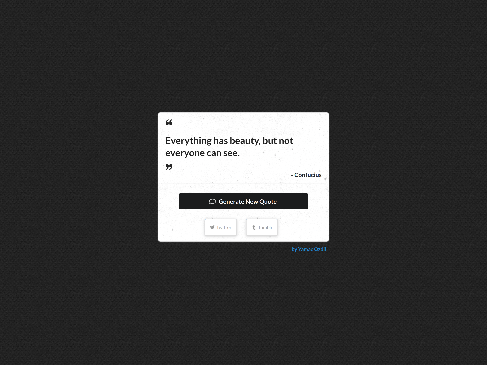

# Random Quote Machine

## Author
[Yamac Ozdil](https://github.com/yozdil)

## About

This project was done for Front End Development Libraries Certification at [freeCodeCamp](https://www.freecodecamp.org). At it's core it uses React and Semantic UI for simple visuals and mobile responsiveness. Quotes are simply fetched via Axios and the user can generate a new quote to share on Twitter or Tumblr.

## Setup

1. Install dependencies with `npm install`.
2. Right after `npm start` and share the quotes on social media!